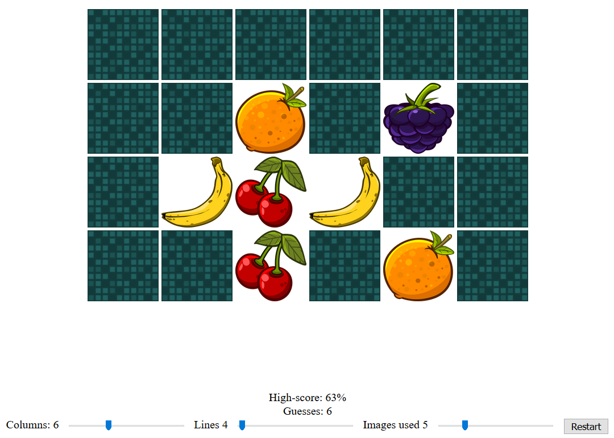

# [Try it out](http://nbpt.eu/games/pair/) #

Match identical tiles with each other, to make a pair. Find all the pairs to win the game.

# Build #

Requires `nodejs`.

- npm install
- grunt

# Images #

- [Fruits](http://opengameart.org/content/fruit-icons-redo) -- license: [CC-BY 3.0](https://creativecommons.org/licenses/by/3.0/)
- [Tile](http://opengameart.org/content/tile) -- license: [CC-BY 3.0](https://creativecommons.org/licenses/by/3.0/)

# Libraries #

- [Utilities](https://bitbucket.org/drk4/javascript_utilities)